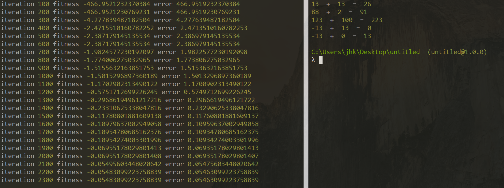

## General information
This project is a simple recurrent neural network build with Neataptic. The goal is to create a model that can correctly apply the principle of adding integers.

## Libraries
Project is created with:
* Neataptic: 1.4.7

## Setup
`$ npm install`

## Train model
`$ node train_model.js`

## Test saved model
`$ node test_model.js`

## Results

Regardless of optimization issues, the results of less than two-minute training
were very promising especially because training dataset doesn't include
negative integers, number 88 and 123, yet the model was able to predict equations with high precision.

